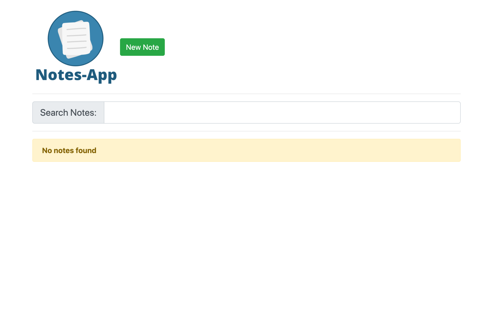

# Notes-App

Create and store your notes for later purpose!

User Stories
------------

-   User can create a note
-   User can edit a note
-   User can delete a note
-   When closing the browser window the notes will be stored and when the User returns, the data will be retrieved
-   User can see the date when they created & updated the note
-   User can filter/search notes

Screenshots
-----------

### Empty home screen

### Creating a note

### Notes on home screen

### Editing a note

### Filtering all notes
